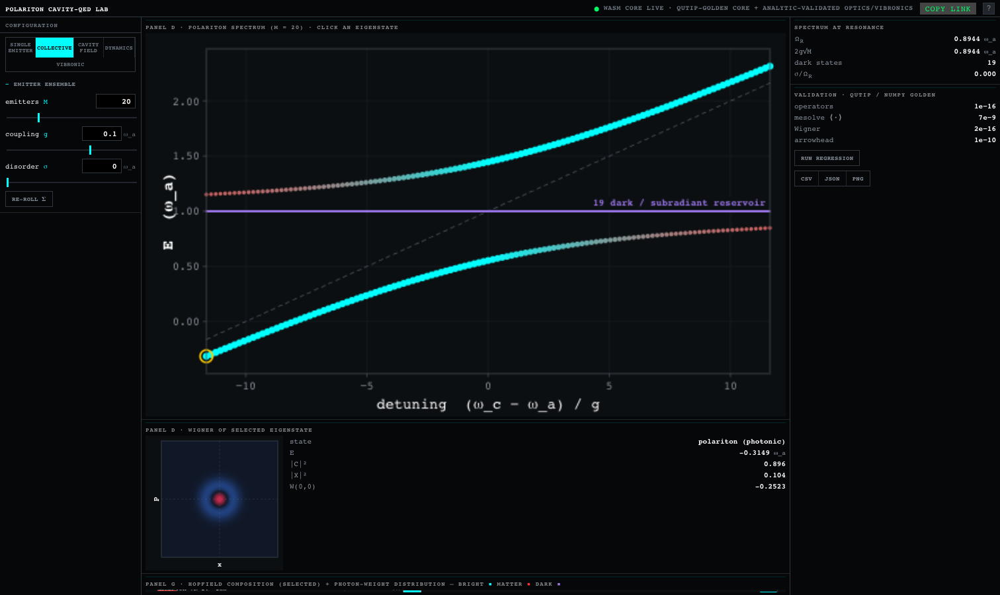
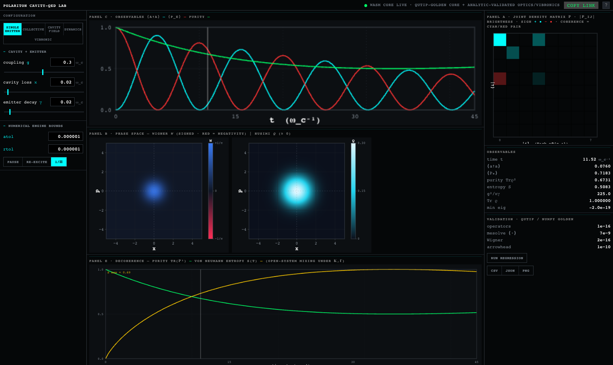

# polariton-sim

An open-source, in-browser cavity-QED instrument. Its quantum core — Jaynes–Cummings Lindblad dynamics, the Tavis–Cummings collective spectrum, the Wigner function, and the partial trace — is checked element-by-element against **QuTiP 5.3 / NumPy** goldens committed to the repo; the auxiliary modules (transfer-matrix cavity optics, Holstein–Tavis–Cummings vibronics, FFT transmission) are checked against **closed-form analytic benchmarks**. Every number states which arbiter validates it — see [`docs/VALIDATION.md`](docs/VALIDATION.md).

**Live:** <https://sim-woad.vercel.app>





## What it is

`polariton-sim` is a focused cavity quantum electrodynamics (cavity-QED) instrument that runs entirely in the browser. It ships **five regime tabs** — three built on the QuTiP-golden quantum core (single-emitter Lindblad, collective spectrum, and the live many-body dynamics that animates it), plus two on analytically-validated auxiliaries (the transfer-matrix cavity-field tab and the Holstein–Tavis–Cummings vibronic tab). The two foundational regimes and the bridge that connects them are described below; the cavity, dynamics, and vibronic tabs extend the same Hamiltonians (open Jaynes–Cummings; single-excitation Tavis–Cummings; and its vibronic generalization H = ω_c a†a + ω_x σ†σ + ω_v b†b + λω_v σ†σ(b+b†) + g(a†σ + aσ†)).

**Regime 1 — single emitter, open dynamics.** One two-level emitter in a single lossy cavity mode (the Jaynes–Cummings model). The state evolves under the Lindblad master equation, with cavity photon loss at rate `kappa` and emitter decay at rate `gamma`. The tool shows the live Wigner quasiprobability of the cavity field and the vacuum-Rabi dynamics as the excitation oscillates between emitter and cavity.

**Regime 2 — many emitters, collective spectrum.** `M` emitters share a single cavity mode in the single-excitation subspace (Tavis–Cummings). In this subspace the Hamiltonian is an *arrowhead* matrix, so it can be diagonalized exactly at a cost that grows only linearly in `M`. The result is the polariton anticrossing spectrum: two bright polariton branches plus `M − 1` dark states, with optional Gaussian energy disorder of width `sigma` across the emitters.

**The bridge.** Clicking any eigenstate in the Regime-2 spectrum traces out its cavity-reduced state,

```
rho = (1 − |C|²) |0⟩⟨0| + |C|² |1⟩⟨1|,
```

where `|C|²` is the photon fraction of that eigenstate, and renders *its* Wigner function. At the origin this gives `W(0,0) = (1 − 2|C|²) / pi`: bright polaritons (photon-rich, `|C|² > 1/2`) push the Wigner function negative — a signature of non-classicality — while dark states (`|C|² = 0`) stay at the positive vacuum value. The bridge makes the link between the collective spectrum and the single-mode quantum optics of Regime 1 directly visible.

## Validation

Validation is the point of this project. The Rust compute core is checked element-by-element against reference values generated by **QuTiP 5.3.0** and **NumPy** — nothing is asserted from memory. The reference ("golden") values are committed to the repo, and the same checks run both natively (`cargo test`) and again through the compiled WebAssembly boundary in Node.

| Check | Result | Test file |
| --- | --- | --- |
| Operators (cavity-first tensor convention) vs QuTiP | max element error ≈ 1e-16 | `wasm/tests/operator_lock.rs` |
| Hamiltonian Hermiticity ‖H − H†‖ | < 1e-12 | `wasm/tests/operator_lock.rs` |
| Lindblad evolution (adaptive Dormand–Prince / Dopri5) vs QuTiP `mesolve` | max\|Δ⟨a†a⟩\|, \|Δ⟨P_e⟩\| = 6.9e-9; Tr ρ = 1.0; min eig ρ = −2.2e-16 | `wasm/tests/solver_golden.rs` |
| Wigner (faithful port of QuTiP `_wigner_clenshaw`, g = √2), coherent state vs QuTiP | 2.2e-16 | `wasm/tests/wigner_golden.rs` |
| Wigner, cat state vs QuTiP | 2.8e-16 | `wasm/tests/wigner_golden.rs` |
| Wigner, cat-state negativity | −0.2330 (exact); ∫∫ W = 1.0 | `wasm/tests/wigner_golden.rs` |
| Partial trace vs QuTiP `ptrace(0)` | exact (0.0) | `wasm/tests/wigner_golden.rs` |
| Arrowhead spectrum vs `numpy.linalg.eigh` (eigenvalues / photon fractions) | < 1e-10 / < 1e-9 | `wasm/tests/spectrum_golden.rs` |
| Identical resonant emitters: collective splitting + dark-state count | 2g√M splitting (exact) and exactly M − 1 zero-photon dark states | `wasm/tests/spectrum_golden.rs` |
| Node WASM-boundary recheck | solver 6.9e-9; Wigner 2.2e-16; ∫∫ W = 1.0 — identical to native | `wasm/validate_wasm.cjs` |

In total this is **22 `cargo` tests across 8 files (11 of them QuTiP 5.3 / NumPy golden checks, the rest closed-form analytic and operator-convention locks) plus the Node WASM-boundary recheck**. The full breakdown is in [`docs/VALIDATION.md`](docs/VALIDATION.md). The goldens are produced by `golden/gen_golden.py` and `golden/gen_spectrum_golden.py` (QuTiP 5.3.0 + NumPy, run in a `uv` virtual environment) and committed as `wasm/golden/golden.json` and `wasm/golden/spectrum_golden.json`. The conventions behind each check, including the cavity-loss relation `kappa = c(1 − R) / nL` and the RdBu colormap midpoint `#F7F7F7`, are source-cited in `docs/GROUNDING-RESEARCH.md`.

**Analytically-validated auxiliaries.** Three modules are validated against closed-form benchmarks rather than QuTiP goldens — and the UI labels them as such, never claiming QuTiP for them:

| Module | Validated against | Test file |
| --- | --- | --- |
| `optics.rs` — transfer-matrix DBR cavity (reflectance, `|E(z)|²`) | exact Fresnel single-interface + quarter-wave high-reflector formulae | `wasm/tests/optics.rs` |
| `htc.rs` — Holstein–Tavis–Cummings vibronics | analytic `g→0` Franck–Condon progression `Iₙ = e^{−S}Sⁿ/n!` | `wasm/tests/htc.rs` |
| `fft.rs` — cavity transmission / PL power spectrum | radix-2 FFT identities + the bright-polariton doublet at the eigen-energies | `wasm/tests/fft_spectrum.rs` |

## Tech stack & architecture

The architecture is a small, validated compute core wrapped in a thin rendering layer.

- **Compute core — Rust crate `cqed_core`.** Dense complex linear algebra via `nalgebra` 0.33 and `num-complex` 0.4, with **no BLAS dependency**, so the crate compiles cleanly to `wasm32`. It is split into `src/operators.rs` (operator construction and tensor convention), `src/solver.rs` (Lindblad / Dopri5), `src/wigner.rs` (Wigner and partial trace), `src/spectrum.rs` (arrowhead diagonalization), `src/optics.rs` (transfer-matrix DBR cavity), `src/htc.rs` (Holstein–Tavis–Cummings vibronics), `src/fft.rs` (transmission power spectrum), and `src/wasm_api.rs` (the `wasm-bindgen` surface). Built with `wasm-pack` to both `web` and `nodejs` targets.
- **Frontend — Vite + React + TypeScript.** A dense, dark, multi-panel instrument UI; rendering is done on a 2D `<canvas>` via `putImageData`. The dark theme maps the Wigner function with a diverging colormap centered on a deep-slate zero (cobalt for positive, crimson for negative / non-classical). The validated Rust core additionally provides the exact matplotlib / ColorBrewer **RdBu** colormap (light-gray midpoint `#F7F7F7`), which the colormap gate test in `wigner_golden.rs` checks. The 2D physics views use plain 2D `<canvas>`; the cavity cross-section regime additionally renders a matte Fabry–Pérot schematic with **React Three Fiber** (three.js) — grounded in real Nature/APS figures, deliberately flat (no bloom/neon/reflections).

The same Rust core that the test suite validates is the code that ships to the browser; the Node boundary check exists specifically to confirm the physics is preserved across the JS↔WASM boundary.

## Build & run

**Run the Rust tests:**

```
cargo test --manifest-path wasm/Cargo.toml
```

**Build the WebAssembly packages** (web and Node targets):

```
wasm-pack build wasm --target web --out-dir pkg-web --out-name cqed_core
wasm-pack build wasm --target nodejs --out-dir pkg --out-name cqed_core
```

**Run the Node WASM-boundary validation:**

```
node wasm/validate_wasm.cjs
```

**Regenerate the goldens** (requires the Python venv set up under `golden/`):

```
golden/.venv/bin/python golden/gen_golden.py
golden/.venv/bin/python golden/gen_spectrum_golden.py
```

**Run the frontend:**

```
npm install
npm run dev      # http://localhost:5180
npm run build
```

## Repository layout

```
wasm/        Rust crate cqed_core
  src/         operators.rs, solver.rs, wigner.rs, spectrum.rs, optics.rs, htc.rs, fft.rs, wasm_api.rs
  tests/       operator_lock.rs, solver_golden.rs, wigner_golden.rs, spectrum_golden.rs,
               optics.rs, htc.rs, fft_spectrum.rs, husimi_entropy.rs
  golden/      golden.json, spectrum_golden.json (committed reference values)
  validate_wasm.cjs   Node WASM-boundary recheck
  pkg/ pkg-web/       wasm-pack output (gitignored)
src/         React / TypeScript app: App.tsx, quantum/engine.ts, styles.css, main.tsx
golden/      Python golden generators + .venv (gitignored)
docs/        physics specs and GROUNDING-RESEARCH.md (source-cited conventions)
index.html, package.json, tsconfig.json, vite.config.ts
```

## Scope & caveats

This is intentionally a narrow, validated subset of cavity-QED, not a general solver:

- **Single cavity mode only.** It is not multimode.
- **Regime 1 is one emitter.** It runs the full Lindblad master equation on a 32-dimensional Hilbert space (cavity ⊗ emitter).
- **Regime 2 is the single-excitation subspace.** There is no multi-excitation physics and no full `2^M`-dimensional multi-emitter Lindblad evolution. That cost was avoided on purpose; the arrowhead structure is what keeps Regime 2 exact and linear in `M`.

It is **not** a QuTiP replacement, **not** a novel research result, and makes no claims about performance, specific browser support, or any feature not described above. It is best understood as a correct, open, teachable cavity-QED instrument: the quantum core's every number is re-checkable against a committed QuTiP/NumPy golden, and the optical/vibronic auxiliaries against the closed-form benchmarks tabulated above — each labeled, in the UI and here, with the arbiter that actually validates it.

## References

- **QuTiP** — J. R. Johansson, P. D. Nation, and F. Nori, *QuTiP: An open-source Python framework for the dynamics of open quantum systems*. The reference values are generated with QuTiP 5.3.0. <https://qutip.org/>
- **Sharma & Chen (2024)** — collective electron transfer / polariton model, *J. Chem. Phys.* **161**, 104102 (2024). (Single-mode, homogeneous coupling; see `docs/GROUNDING-RESEARCH.md`.)
- **matplotlib `RdBu`** — the diverging ColorBrewer RdBu colormap used for the Wigner rendering, with midpoint `#F7F7F7`. <https://matplotlib.org/>


