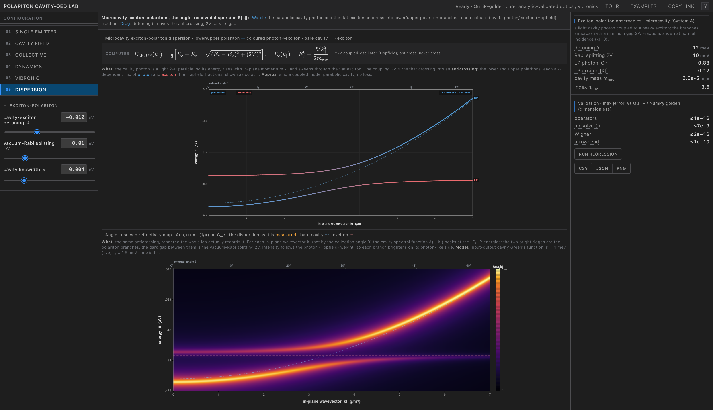
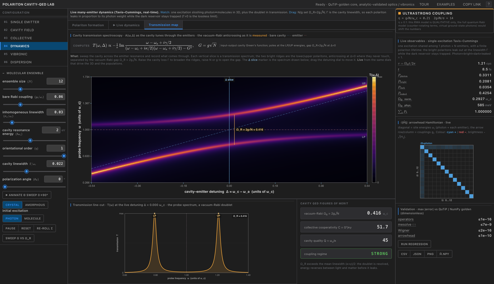

<div align="center">

# Polariton Cavity-QED Lab

**A validation-first cavity quantum electrodynamics instrument that runs entirely in the browser.**

A Rust→WebAssembly quantum core, checked element by element against QuTiP 5.3 / NumPy goldens, wrapped in a dense, dark, six-tab instrument UI. Every number is re-checkable against a committed reference; nothing is asserted from memory.

[**Live instrument →  cqed-lab.vercel.app**](https://cqed-lab.vercel.app)

[](https://cqed-lab.vercel.app)
[](docs/VALIDATION.md)
[](wasm/)
[](docs/VALIDATION.md)
[](LICENSE)



</div>

## What it is

`polariton-sim` is a cavity quantum electrodynamics (cavity-QED) workbench that compiles the physics to WebAssembly and runs with zero install. It ships **six regime tabs** spanning single-emitter quantum optics through collective polariton chemistry:

| Tab | Physics | Backed by |
| --- | --- | --- |
| **Single emitter** | One two-level emitter in a lossy cavity (open Jaynes–Cummings); live Wigner and Husimi phase space, vacuum-Rabi observables, the running density matrix | QuTiP-golden quantum core |
| **Cavity field** | A transfer-matrix DBR Fabry–Pérot cavity: reflectance `R(λ)`, the stopband, `\|E(z)\|²`, and the `2g√N` strong-coupling crossover vs cavity loss | Closed-form optics |
| **Collective** | `M` emitters sharing one mode (Tavis–Cummings, single excitation): the polariton anticrossing spectrum, the `M − 1` dark-state reservoir, and a per-eigenstate Wigner bridge | QuTiP-golden quantum core |
| **Dynamics** | The vacuum-Rabi beat in real time (3D cavity + populations + transmission), polariton formation, and a transmission-spectroscopy map | QuTiP-golden quantum core |
| **Vibronic** | Holstein–Tavis–Cummings: the Franck–Condon progression, cavity reshaping of the absorption, and the polaron-renormalized coupling `Ω_R^eff(N)` | Closed-form vibronics |
| **Dispersion** | Microcavity exciton-polaritons: `E(k‖)` from the 2×2 coupled-oscillator model and the angle-resolved reflectivity heatmap, the way a lab actually records the dispersion | Closed-form Hopfield model |

All six are driven by the same Hamiltonians: the open Jaynes–Cummings model, the single-excitation Tavis–Cummings arrowhead, and its vibronic generalization `H = ω_c a†a + ω_x σ†σ + ω_v b†b + λω_v σ†σ(b + b†) + g(a†σ + aσ†)`.

## What you can see

The UI is built to read like real instrument software (dark graphite chrome, white-on-dark scopes, one restrained accent), with the physics drawn straight to `<canvas>`:

- **Wigner and Husimi phase space** of the cavity field, faithful ports of QuTiP's `_wigner_clenshaw` (g = √2), with the `±1/π` Fock floor as a colorbar. Bright polaritons push the Wigner function negative, the signature of non-classicality.
- **The collective polariton spectrum** as a true anticrossing: two bright branches plus the `M − 1` dark states pinned at `ω_a`, colored by photon (Hopfield) fraction, with optional Gaussian disorder.
- **The eigenstate → Wigner bridge.** Click any eigenstate in the collective spectrum and the tool traces out its cavity-reduced state `ρ = (1 − |C|²)|0⟩⟨0| + |C|²|1⟩⟨1|` and renders *its* Wigner function, making the link between the many-body spectrum and single-mode quantum optics literally visible.
- **Angle-resolved reflectivity** `A(ω, k‖) = −(1/π) Im G_c`, the exciton-polariton dispersion rendered as a perceptually-uniform `inferno` heatmap, the two bright branches anticrossing exactly as in angle-resolved spectroscopy.
- **Transmission spectroscopy** `A(ω, Δ)` as the cavity tunes through the emitters: the vacuum-Rabi anticrossing in transmission, with a live `Δ`-slice cursor, the line-cut doublet, and a cavity-QED figures-of-merit panel (`Ω_R`, collective cooperativity, cavity `Q`, strong/weak regime).
- **Live many-body dynamics in 3D**: one excitation sloshing between a standing-wave cavity field and the emitter ensemble, photon-weighted loss leaking the bright polaritons while the dark reservoir stays trapped.

<div align="center">




</div>

## Validation

Validation is the point of this project. The Rust compute core is checked element by element against reference values generated by **QuTiP 5.3.0** and **NumPy**. The reference ("golden") values are committed to the repo, and the same checks run both natively (`cargo test`) and again through the compiled WebAssembly boundary in Node, so the physics is proven preserved across the JS↔WASM line.

| Check | Result | Test file |
| --- | --- | --- |
| Operators (cavity-first tensor convention) vs QuTiP | max element error ≈ 1e-16 | `wasm/tests/operator_lock.rs` |
| Hamiltonian Hermiticity ‖H − H†‖ | < 1e-12 | `wasm/tests/operator_lock.rs` |
| Lindblad evolution (adaptive Dormand–Prince) vs QuTiP `mesolve` | max\|Δ⟨a†a⟩\|, \|Δ⟨P_e⟩\| = 6.9e-9; Tr ρ = 1.0; min eig ρ = −2.2e-16 | `wasm/tests/solver_golden.rs` |
| Wigner (faithful `_wigner_clenshaw`, g = √2), coherent + cat states vs QuTiP | 2.2e-16 / 2.8e-16 | `wasm/tests/wigner_golden.rs` |
| Wigner cat-state negativity | −0.2330 (exact); ∫∫ W = 1.0 | `wasm/tests/wigner_golden.rs` |
| Partial trace vs QuTiP `ptrace(0)` | exact (0.0) | `wasm/tests/wigner_golden.rs` |
| Arrowhead spectrum vs `numpy.linalg.eigh` (eigenvalues / photon fractions) | < 1e-10 / < 1e-9 | `wasm/tests/spectrum_golden.rs` |
| Identical resonant emitters: collective splitting + dark-state count | `2g√M` splitting (exact), exactly `M − 1` dark states | `wasm/tests/spectrum_golden.rs` |
| Node WASM-boundary recheck | identical to native | `wasm/validate_wasm.cjs` |

In total: **22 `cargo` tests across 8 files** (11 QuTiP 5.3 / NumPy golden checks, the rest closed-form analytic and operator-convention locks), the **Node WASM-boundary recheck**, and **23 `vitest` cases** for the closed-form analytic engine (optics, Franck–Condon vibronics, the Hopfield dispersion model, and the Marcus / `N_max` electron-transfer oracle). The full breakdown is in [`docs/VALIDATION.md`](docs/VALIDATION.md); the conventions behind each check are source-cited in [`docs/GROUNDING-RESEARCH.md`](docs/GROUNDING-RESEARCH.md).

**Analytically validated auxiliaries.** The optics, vibronics, and dispersion modules are checked against closed-form benchmarks rather than QuTiP, and the UI labels them as such, never claiming QuTiP for them:

| Module | Validated against | Test file |
| --- | --- | --- |
| `optics.rs`, transfer-matrix DBR cavity | exact Fresnel + quarter-wave high-reflector formulae | `wasm/tests/optics.rs` |
| `htc.rs`, Holstein–Tavis–Cummings vibronics | analytic `g→0` Franck–Condon progression `Iₙ = e^{−S}Sⁿ/n!` | `wasm/tests/htc.rs` |
| `fft.rs`, transmission / PL power spectrum | radix-2 FFT identities + the bright-polariton doublet at the eigen-energies | `wasm/tests/fft_spectrum.rs` |
| `engine/` (dispersion, Hopfield, optics, Marcus oracle) | textbook coupled-oscillator + closed-form analytic limits | `engine/__tests__/engine.test.ts` |

## Architecture

A small, validated compute core wrapped in a thin rendering layer.

- **Compute core, Rust crate `cqed_core`.** Dense complex linear algebra via `nalgebra` 0.33 and `num-complex` 0.4, with **no BLAS dependency**, so it compiles cleanly to `wasm32`. Split into `operators.rs` (tensor convention), `solver.rs` (Lindblad / Dopri5), `wigner.rs` (Wigner + partial trace), `spectrum.rs` (arrowhead diagonalization), `optics.rs` (transfer-matrix DBR), `htc.rs` (vibronics), `fft.rs` (transmission spectrum), and `wasm_api.rs` (the `wasm-bindgen` surface). Built with `wasm-pack` to both `web` and `nodejs` targets.
- **Frontend, Vite + React 18 + TypeScript (strict).** A dense, dark, multi-panel UI in the VS Code / instrument-console idiom. Physics views render to 2D `<canvas>`: the Wigner / density-matrix heatmaps use a dark-faced diverging map (blue positive, red negative), and the 2D intensity maps (reflectivity, transmission) use perceptually-uniform `inferno`. The live 3D cavity is a deliberately flat React Three Fiber scene (no neon, restrained bloom), grounded in published Nature / APS figures.
- **TypeScript analytic engine, `engine/`.** A closed-form oracle (coupled-oscillator dispersion, Hopfield fractions, transfer-matrix optics, Franck–Condon, Marcus / `N_max` electron transfer) that powers the optics, vibronic, and dispersion tabs and is itself unit-tested.

The same Rust core the test suite validates is the code that ships to the browser. The pre-built WASM (`wasm/pkg-web/`) is committed, so the frontend builds with no Rust toolchain.

## Quick start

```bash
# frontend (no Rust toolchain needed, pre-built WASM is committed)
npm install
npm run dev            # http://localhost:5180
npm run build

# the analytic engine + WASM-boundary tests
npm run test           # vitest + node WASM-boundary recheck

# the Rust quantum core
cargo test --manifest-path wasm/Cargo.toml

# rebuild the WASM (requires wasm-pack)
wasm-pack build wasm --target web    --out-dir pkg-web --out-name cqed_core
wasm-pack build wasm --target nodejs --out-dir pkg     --out-name cqed_core

# regenerate the QuTiP / NumPy goldens (requires the golden/ Python venv)
golden/.venv/bin/python golden/gen_golden.py
golden/.venv/bin/python golden/gen_spectrum_golden.py
```

## Repository layout

```
wasm/        Rust crate cqed_core
  src/         operators · solver · wigner · spectrum · optics · htc · fft · wasm_api
  tests/       operator_lock · solver_golden · wigner_golden · spectrum_golden · optics · htc · fft · husimi_entropy
  golden/      golden.json, spectrum_golden.json (committed QuTiP / NumPy reference values)
  validate_wasm.cjs   Node WASM-boundary recheck
  pkg-web/     wasm-pack web output (committed, so the app builds with no Rust toolchain)
src/         React / TypeScript app: App.tsx, cavity/ (3D scene), quantum/engine.ts (WASM wrapper), styles.css
engine/      closed-form analytic oracle + engine.test.ts (optics / vibronics / dispersion / Marcus)
golden/      Python golden generators (QuTiP 5.3.0 + NumPy)
docs/        VALIDATION.md · GROUNDING-RESEARCH.md · PHYSICS-SPEC.md · REFERENCES.md
```

## Scope and caveats

Intentionally a narrow, validated subset of cavity-QED, not a general solver:

- **Single cavity mode only.** Not multimode.
- **Single emitter runs the full Lindblad** master equation on a 32-dimensional Hilbert space (cavity ⊗ emitter).
- **Collective is the single-excitation subspace.** The arrowhead structure keeps it exact and linear in `M`; there is no multi-excitation or full `2^M` Lindblad evolution, by design.
- The dispersion and transmission maps are the textbook coupled-oscillator and input-output cavity Green's-function formulas, rendered live; they are illustrative spectroscopy, not a full open-system simulation.

It is **not** a QuTiP replacement and **not** a novel research result. It is a correct, open, teachable cavity-QED instrument: every number in the quantum core is re-checkable against a committed QuTiP / NumPy golden, and the optical, vibronic, and dispersion auxiliaries against the closed-form benchmarks above, each labeled, in the UI and here, with the reference that validates it.

## References

- **QuTiP**, J. R. Johansson, P. D. Nation, F. Nori, *QuTiP: An open-source Python framework for the dynamics of open quantum systems*. Reference values generated with QuTiP 5.3.0. <https://qutip.org/>
- **Sharma & Chen (2024)**, collective electron transfer / polariton model, *J. Chem. Phys.* **161**, 104102.
- **Hopfield (1958)**, *Theory of the contribution of excitons to the complex dielectric constant of crystals*, *Phys. Rev.* **112**, 1555 (the polariton coupled-oscillator model).
- **matplotlib** `inferno` (2D intensity maps) and `RdBu` (Wigner reference colormap, midpoint `#F7F7F7`). <https://matplotlib.org/>

## License

MIT, see [LICENSE](LICENSE).
